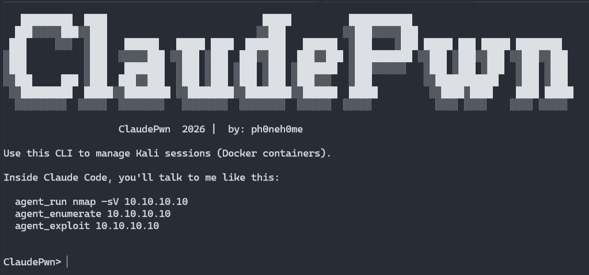

# ClaudePwn — AI-Assisted Pentesting Framework (Kali + MCP + Claude Code)
_by_ _ph0neh0me_



***

## ⚠ SECURITY WARNING:

This tool launches privileged Docker containers with elevated capabilities
and exposes services on ports 8000 and 8080.

Improper use may result in system compromise or unauthorized access.

Do NOT run on public servers or expose these ports externally.

Use only in isolated lab environments or on systems you own or have
explicit permission to test.

***

## ⚖ LEGAL DISCLAIMER:

This tool is intended for educational and authorized security testing purposes only.

The author does not condone or support illegal or unethical activities.
Users are solely responsible for ensuring their use complies with all applicable laws
and regulations.

The author assumes no liability for any misuse or damage caused by this tool.

***

ClaudePwn is a modular, dual-pipeline penetration testing framework that combines:

- A containerized Kali Linux environment (Docker)
- A FastMCP-based tool server inside the Kali container
- Claude Code as the autonomous agent layer
- A Python CLI for session management, orchestration, and workflow control

ClaudePwn enables AI-assisted pentesting in a **controlled lab environment** with:

- Real command execution (nmap, ffuf, impacket, NXC, etc.)
- Strict boundaries (everything runs inside the Kali container)
- A clean workflow between operator, agent, and tools

***

## Quick Start

1. Clone the repository

2. Create and activate a virtual environment:

	```
    python -m venv venv
    .\venv\Scripts\activate          # Windows
    source venv/bin/activate         # Linux/macOS
	```
	
3. Install dependencies:

    `pip install -r requirements.txt`

4. Download Claude Code

	`irm https://claude.ai/install.ps1 | iex`

	Note: Set `\.local\bin` in User PATH variable

5. Start ClaudePwn:

    `python claudepwn.py`

6. Build the Kali image and create a session:

	```
    ClaudePwn> sessions_refresh
    ClaudePwn> sessions_create test
	```
	
7. Launch Claude Code:

    `ClaudePwn> launch_claude`

***

## Project Structure

Top-level layout:

- `claudepwn.py`
    Main CLI entrypoint. Manages sessions, Docker image, and launches Claude Code.

- `sessions.py`
    Session management: create/use/delete sessions, start/stop containers, exec into them.

- `Dockerfile`
    Builds the Kali sandbox image with tools + FastMCP server.

- `kali_mcp_server.py`
    MCP HTTP server running inside the Kali container. Exposes primitive tools.

- .claude/
    - config.json              → Project metadata for Claude Code
    - mcp.json                 → MCP HTTP server registration
    - security-agent.md        → Behavior + rules for the ClaudePwn agent
    - pentest-workflow.md      → Suggested enumeration & exploitation flow
    - tools-reference.md       → Quick reference of Kali tools available

- sessions/
    Created at runtime. Each session gets its own:
    - workspace/               → Mounted into /workspace inside the container

***

## High-Level Architecture

User interaction flow:

    USER
      │
      ├── ClaudePwn CLI (claudepwn.py)
      │       ├── Manages Docker image (build/refresh)
      │       ├── Creates & switches sessions
      │       ├── Mounts ./sessions/<name>/workspace → container:/workspace
      │       └── Launches Claude Code in the project folder
      │
      ├── Claude Code (AI agent)
      │       ├── Reads .claude/*.md memory files
      │       ├── Understands agent_* commands from the user
      │       └── Uses MCP to call tools in the Kali container
      │
      └── Kali Container (Docker)
              └── FastMCP HTTP server (/mcp)
                     ├── run_command
                     ├── list_dir
                     ├── read_file
                     ├── write_file
                     └── tail_log

***

## MCP Tools (Inside Kali)

The file `kali_mcp_server.py` runs a FastMCP-based HTTP server at:

    http://0.0.0.0:8000/mcp

It exposes the following tools, all sandboxed under `/workspace`:

- run_command(command, cwd=None, timeout=1200)
    Execute a shell command inside the Kali container.
    - Uses /workspace as default cwd.
    - Output is captured and truncated for safety.

- list_dir(path=".")
    List directory contents under /workspace.

- read_file(path, max_bytes=65536)
    Read a file under /workspace (content is truncated to max_bytes).

- write_file(path, content, append=False)
    Create or modify a text file under /workspace.

- tail_log(path, max_lines=200)
    Tail the last N lines of a file under /workspace (good for long-running logs).

***

## Claude Code Integration

ClaudePwn uses a `.claude` directory to configure:

- MCP server connection
- agent behavior
- tool definitions

Claude Code is launched in the root of the project (where `claudepwn.py` lives).

The `.claude` folder provides:

- `tools.json`
    Defines the MCP tool interface (schema) available to the agent.
    - Specifies which tools exist (run_command, file operations, etc.)
    - Defines input parameters, types, and required fields
    - Acts as a contract between Claude Code and the Kali MCP server
	
- `config.json`
    Basic project metadata, including which memory files to load.

- `mcp.json`
    Tells Claude Code there is an HTTP MCP server available:
		```
        {
            "mcpServers": {
                "claude_pwn": {
                    "url": "http://localhost:8000/mcp",
                    "type": "http"
                }
            }
        }
		```

- `claudepwn-handshake.md`
    Initial context file that orients the agent.
    - Explains where to find memory files and tool definitions
    - Establishes how ClaudePwn is structured
    - Acts as the entry point for agent understanding
	
- `security-agent.md`
    Defines the ClaudePwn agent persona:
    - Knows it is in a lab / CTF context.
    - Knows it must use MCP tools, not hallucinate outputs.
    - Defines how to react to agent_* commands.

- `pentest-workflow.md`
    Hints for enumeration/exploitation:
    - Typical nmap scans
    - Service-based branching (SMB/HTTP/RDP/etc.)
    - When to stop or summarize findings

- `tools-reference.md`
    Quick cheat sheet of installed tools (nmap, ffuf, gobuster, NXC, impacket, SecLists, etc.).

***

## ClaudePwn CLI (claudepwn.py)

The CLI provides a REPL with commands like:

	```
    sessions_refresh
    sessions_list
    sessions_create <name>
    sessions_use <name>
    sessions_delete <name>
    sessions_nuke

    sessions_shell
    sessions_exec <cmd>
    sessions_start
    sessions_stop
    sessions_ps

    launch_claude
	```

Key behaviors:

- `sessions_refresh`
    - Rebuilds the Docker image from the local Dockerfile.
    - If there's an active session, restarts its container with the workspace mount.

- `sessions_create <name>`
    - Creates `sessions/<name>/workspace/`.
    - Starts a container named `claude_pwn` mounted with that workspace.

- `sessions_use <name>`
    - Switches to an existing session and restarts the container with its workspace.

- `launch_claude`
    - Ensures the container is running for the current session.
    - Launches Claude Code (via `claude` or a custom command) in the project directory.
    - Claude Code then discovers the MCP server and tools.

***

## Usage Flow (Example)

1. Activate virtualenv and start the CLI:

       python -m venv venv
       .\venv\Scripts\activate          # Windows
       python claudepwn.py

2. Build the Kali image:

       `ClaudePwn> sessions_refresh`

3. Create a new pentest session:

       `ClaudePwn> sessions_create htb_labs`

4. Launch Claude Code:

       `ClaudePwn> launch_claude`

5. In Claude Code, you can now say (for example):

	   ```
	   agent_run nmap -sV 10.10.10.10
       agent_enumerate 10.10.10.10
       agent_exploit 10.10.10.10
	   ```

Claude Code will:

- Parse the command.
- Call MCP `run_command` inside the Kali container.
- Show you the **real output**.
- Plan additional steps using `pentest-workflow.md` as guidance.

***
